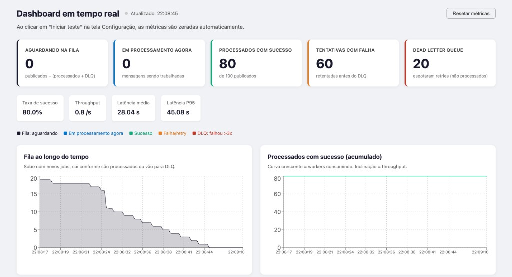

# Simulador FIFO

Projeto didático de simulador de fila de processamento com **todos os serviços rodando no Docker**. Frontend React para configurar testes e visualizar métricas em tempo real, backend Go consumindo Kafka, Dead Letter Queue (DLQ) e delay artificial.

### Screenshot



---

## Arquitetura

```
Frontend (React) ──POST /api/jobs──► Go API ──► Kafka (fila-processamento)
                                                       │
                                              Consumer Go
                                           ┌─────┴──────┐
                                        Sucesso      Falha (retry)
                                           │               │ (após 3x)
                                    Métricas SSE    dead-letter-queue
                                           │
                                     Dashboard React (tempo real)
```

| Serviço        | Container       | Descrição                                    |
|----------------|-----------------|----------------------------------------------|
| Kafka          | fifo-kafka      | Broker KRaft, tópicos principal e DLQ        |
| Server         | fifo-server     | API Go + consumer + processamento + SSE      |
| Frontend       | fifo-frontend   | React (build) servido por nginx + proxy /api |

---

## Pré-requisitos

- [Docker](https://docs.docker.com/get-docker/) e [Docker Compose](https://docs.docker.com/compose/install/)

> **Importante:** Nenhum serviço deve rodar localmente. Kafka, API Go e Frontend devem rodar **somente** via `docker compose`.

---

## Como rodar

```bash
# Clonar e subir tudo
docker compose up --build
```

Acesse **http://localhost:3000**

### Stack de monitoramento (opcional)

```bash
docker compose --profile monitoring up --build
```

| Serviço    | URL                          |
|------------|------------------------------|
| Kafka UI   | http://localhost:8081        |
| Prometheus | http://localhost:9090        |
| cAdvisor   | http://localhost:8082        |
| Grafana    | http://localhost:3001 (admin/admin) |

---

## Como usar

1. **Configuração** — defina quantidade de registros, tipo de tarefa (`e-mail` leve / `imagem` pesada), intervalo entre envios e % de falha simulada. Clique em **Iniciar teste**.
2. **Dashboard** — acompanhe em tempo real: fila aguardando, em processamento agora, processados, falhas e DLQ. Latência e throughput são atualizados via SSE a cada evento.
3. **DLQ** — veja as mensagens que falharam após o número máximo de retentativas.
4. **Análise** — gráficos históricos de fila, latência e throughput durante a sessão.

---

## Componentes didáticos

| Componente | O que ensina |
|---|---|
| **Fila Kafka** | Desacoplamento produtor/consumidor; ordem FIFO por partição |
| **Dashboard SSE** | Streaming de métricas em tempo real sem polling |
| **Delay artificial** | Diferença entre tarefas leves (e-mail, ~30ms) e pesadas (imagem, ~350ms) |
| **Retry automático** | Reprocessamento de mensagens com falha antes de desistir |
| **Dead Letter Queue** | Destinação de mensagens irrecuperáveis; resiliência de sistemas |
| **cAdvisor + Grafana** | Visibilidade de CPU e memória por container |
